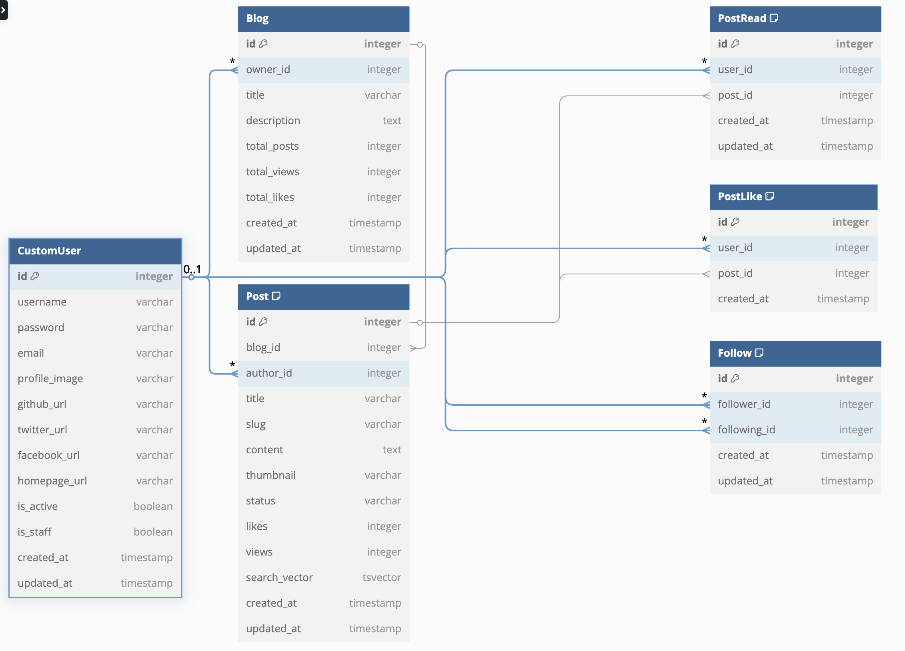

# JustDoLog Database Schema



```
// JustDoLog Database Schema

// User App Models
Table CustomUser {
  id integer [pk]
  username varchar [unique]
  password varchar
  email varchar [unique]
  profile_image varchar
  github_url varchar
  twitter_url varchar
  facebook_url varchar
  homepage_url varchar
  is_active boolean
  is_staff boolean
  created_at timestamp
  updated_at timestamp
}

Table Follow {
  id integer [pk]
  follower_id integer
  following_id integer
  created_at timestamp
  updated_at timestamp
  
  indexes {
    (follower_id, following_id) [unique]
  }
}

// Blog App Models
Table Blog {
  id integer [pk]
  owner_id integer
  title varchar
  description text
  total_posts integer
  total_views integer
  total_likes integer
  created_at timestamp
  updated_at timestamp
}

Table Post {
  id integer [pk]
  blog_id integer
  author_id integer
  title varchar
  slug varchar
  content text
  thumbnail varchar
  status varchar
  likes integer
  views integer
  search_vector tsvector
  created_at timestamp
  updated_at timestamp
  
  indexes {
    (blog_id, slug) [unique]
    search_vector [type: gin]
  }
}

Table PostLike {
  id integer [pk]
  user_id integer
  post_id integer
  created_at timestamp
  
  indexes {
    (user_id, post_id) [unique]
  }
}

Table PostRead {
  id integer [pk]
  user_id integer
  post_id integer
  created_at timestamp
  updated_at timestamp
  
  indexes {
    (user_id, post_id) [unique]
  }
}

// Relationships
Ref: Blog.owner_id > CustomUser.id
Ref: Post.blog_id > Blog.id
Ref: Post.author_id > CustomUser.id
Ref: PostLike.post_id > Post.id
Ref: PostLike.user_id > CustomUser.id
Ref: PostRead.post_id > Post.id
Ref: PostRead.user_id > CustomUser.id
Ref: Follow.follower_id > CustomUser.id
Ref: Follow.following_id > CustomUser.id
```

## 주요 관계 설명:

- CustomUser & Blog: 1:1 관계
  - 각 사용자는 하나의 블로그를 가짐
  - Blog.owner_id가 CustomUser.id를 참조
- CustomUser & Post: 1:N 관계
  - 사용자는 여러 게시글을 작성 가능
  - Post.author_id가 CustomUser.id를 참조
- Blog & Post: 1:N 관계
  - 블로그는 여러 게시글을 포함
  - Post.blog_id가 Blog.id를 참조
- CustomUser & Follow: M:N 관계
  - 사용자는 여러 사용자를 팔로우할 수 있고, 여러 팔로워를 가질 수 있음
  - Follow 테이블이 중간 테이블 역할
- CustomUser & Post (좋아요): M:N 관계
  - 사용자는 여러 게시글에 좋아요 가능
  - PostLike 테이블이 중간 테이블 역할
- CustomUser & Post (조회): M:N 관계
  - 사용자는 여러 게시글을 조회 가능
  - PostRead 테이블이 중간 테이블 역할

## 특별한 제약조건들:
- Follow 테이블: 자기 자신을 팔로우할 수 없음
- PostLike: 동일한 게시글에 중복 좋아요 불가
- Post: blog와 slug의 조합이 unique
- 모든 테이블: 생성/수정 시간 자동 기록